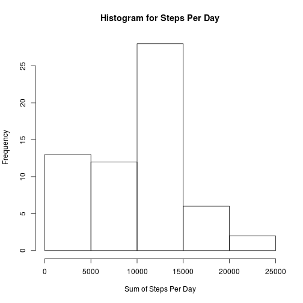

## Loading and preprocessing the data


```r
unzip("activity.zip")
rawData <- read.csv("activity.csv")
rawData$date <- as.Date(rawData$date)
```

## What is mean total number of steps taken per day?

First, lets look at the number of steps taken per day. In this analysis, missing data will be ignored. Here is a histogram describing the distribution of total steps per day:


```r
splitByDay <- split(rawData, rawData$date)
stepsPerDay <- sapply(splitByDay, function(x){ sum(x$steps, na.rm=TRUE)})
hist(stepsPerDay, xlab = "Sum of Steps Per Day", main="Histogram for Steps Per Day")
```



The median steps taken per day is 10395, while the mean is 9354.2295082.
## What is the average daily activity pattern?


## Imputing missing values


## Are there differences in activity patterns between weekdays and weekends?

