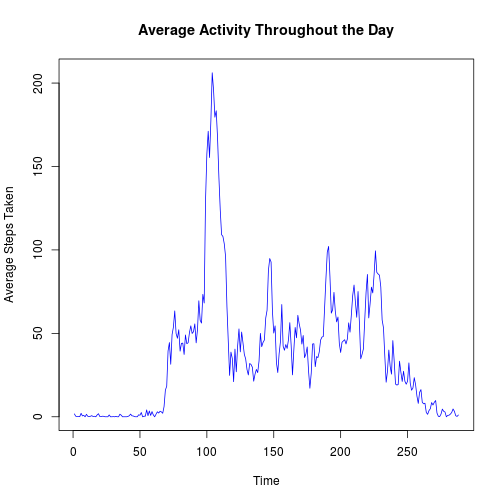

## Loading and preprocessing the data

The data will be unzipped and read as a data frame. The only processing that is performed is to convert the date column into an actual date field.


```r
unzip("activity.zip")
rawData <- read.csv("activity.csv")
rawData$date <- as.Date(rawData$date)
```

## What is mean total number of steps taken per day?

First, we examine the number of steps taken per day. In this analysis, missing data will be ignored.


```r
splitByDay <- split(rawData, rawData$date)
stepsPerDay <- sapply(splitByDay, function(x){ sum(x$steps, na.rm=TRUE)})
hist(stepsPerDay, xlab = "Sum of Steps Per Day", main="Histogram for Steps Per Day")
```


The median steps taken per day is 10395, while the mean is 9354.2295082.
## What is the average daily activity pattern

To explore the average daily activity pattern, we take the mean of every five-minute interval across all days.

```r
splitByInterval <- split(rawData, rawData$interval)
avgSteps <- sapply(splitByInterval, function(x){mean(x$steps, na.rm=TRUE)})
plot.ts(avgSteps,ylab="Average Steps Taken", xlab="Time", main="Average Activity Throughout the Day")
```



```r
mostActiveInterval <- names(which.max(avgSteps))
hourOfDay <- as.integer(as.integer(mostActiveInterval)/60)
minuteOfHour <-as.integer(mostActiveInterval)- hourOfDay*60
```

On average, the most steps were taking on the interval named 835, which is 13:55.

## Imputing missing values


## Are there differences in activity patterns between weekdays and weekends?

