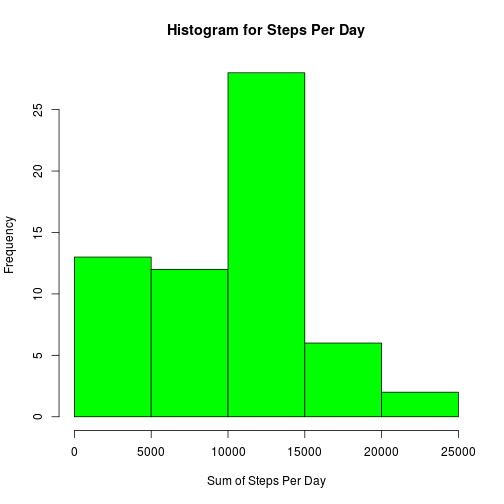

## Loading and preprocessing the data

The data will be unzipped and read as a data frame. The only processing that is performed is to convert the date column into an actual date field.


```r
unzip("activity.zip")
rawData <- read.csv("activity.csv")
rawData$date <- as.Date(rawData$date)
```

## What is mean total number of steps taken per day?

First, we examine the number of steps taken per day. In this analysis, missing data will be ignored.


```r
splitByDay <- split(rawData, rawData$date)
stepsPerDay <- sapply(splitByDay, function(x){ sum(x$steps, na.rm=TRUE)})
hist(stepsPerDay, xlab = "Sum of Steps Per Day", main="Histogram for Steps Per Day", col="green")
```



The median steps taken per day is 10395, while the mean is 9354.2295082.
## What is the average daily activity pattern

To explore the average daily activity pattern, we take the mean of every five-minute interval across all days.

```r
splitByInterval <- split(rawData, rawData$interval)
avgSteps <- sapply(splitByInterval, function(x){mean(x$steps, na.rm=TRUE)})
plot.ts(avgSteps,ylab="Average Steps Taken", xlab="Time", main="Average Activity Throughout the Day", col="blue")
```


```r
mostActiveInterval <- names(which.max(avgSteps))
hourOfDay <- as.integer(as.integer(mostActiveInterval)/60)
minuteOfHour <-as.integer(mostActiveInterval)- hourOfDay*60
```

On average, the most steps were taken on the interval named 835, which is 13:55.

## Imputing missing values


```r
set.seed(1337)

completeCases <-complete.cases(rawData)
completeCaseCount <- sum(completeCases)
missingDataCount <- nrow(rawData) - completeCaseCount
```

There are 17568 observations in the data set, of which 2304 are missing a "steps" count and 15264 are complete.
Since the presence of missing days may introduce some bias, the missing data is filled in by using either the mean or the median value for that interval. Whether the mean or the median is used is determined by a coin flip.


```r
medianSteps <- sapply(splitByInterval, function(x){median(x$steps, na.rm=TRUE)})
completeData <- rawData

completeData[!completeCases,]$steps <- sapply(rawData[!completeCases,]$interval, function(x){
  #randomly decide whether to use median or mean
  coinflip <- rbinom(1,1,.5)[1]
  if(coinflip == 0) {
    avgSteps[as.character(x)]
  } else {
      medianSteps[as.character(x)]
    }
  })

completeSplitByDay <- split(completeData, completeData$date)
completeStepsPerDay <- sapply(completeSplitByDay, function(x){ sum(x$steps, na.rm=TRUE)})
hist(completeStepsPerDay, xlab = "Sum of Steps Per Day", main="Histogram for Steps Per Day With Completed Data", col="green")
```


The median steps taken per day is using "complete" data is 10395, while the mean is 10159.84813. The median value has not changed from the original, incomplete data set, but the mean value has gone up by 805.6186205. The histogram also has a stronger grouping toward the middle.
## Are there differences in activity patterns between weekdays and weekends?

We would like to compare average activity throughout the weekday and weekend. To do so, we will create a factor variable describing whether a day is a weekend or weekday and then graph the average activity accross all time intervals for each.


```r
#convert each day into the string "weekend" or "weekday" and then turn the results into a factor
completeData$typeOfDay <- factor(sapply(completeData$date, function(date){
  day <- weekdays(date)
  if( day == "Saturday" || day == "Sunday" ) {
    "weekend"
  } else {
    "weekday"
  }
}), labels = c("weekday", "weekend"))

completewWeekdays <- completeData[completeData$typeOfDay == 'weekday',]
completeWeekends <- completeData[completeData$typeOfDay == 'weekend',]

splitByIntervalComplete_weekdays <- split(completewWeekdays, completewWeekdays$interval)
completeAverageSteps_weekdays <- sapply(splitByIntervalComplete_weekdays, function(x){mean(x$steps, na.rm=TRUE)})

splitByIntervalComplete_weekends <- split(completeWeekends, completeWeekends$interval)
completeAverageSteps_weekends <- sapply(splitByIntervalComplete_weekends, function(x){mean(x$steps, na.rm=TRUE)})

par(mfrow = c(2,1))
plot.ts(completeAverageSteps_weekdays,ylab="Average Steps Taken", xlab="Time", main="Average Activity Throughout a Weekday", col="blue")
plot.ts(completeAverageSteps_weekends,ylab="Average Steps Taken", xlab="Time", main="Average Activity Throughout on Saturday or Sunday", col="green")
```


